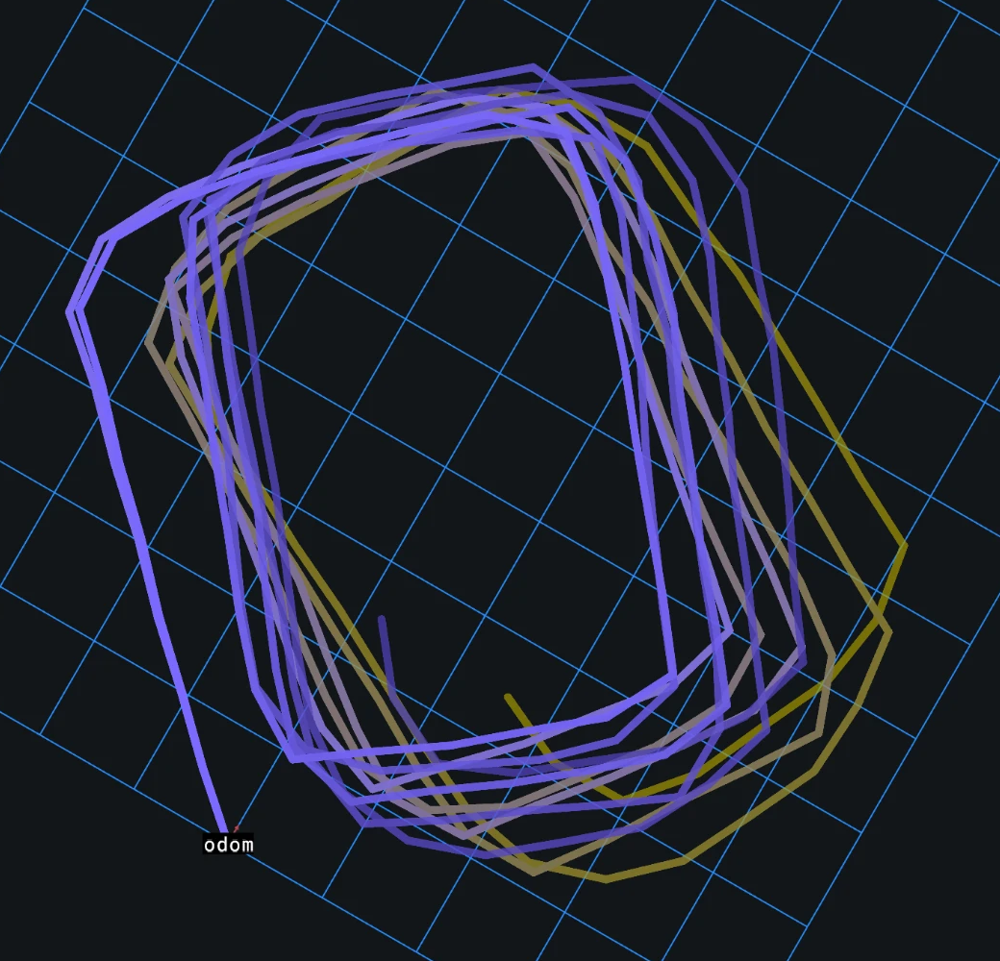
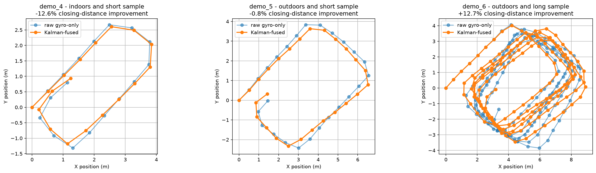
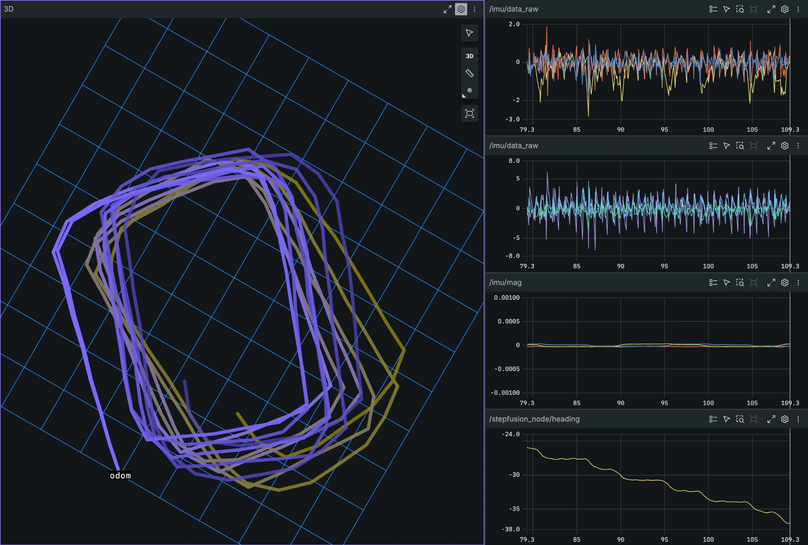

# StepFusion



Pedestrian Dead Reckoning from real phone IMU data (Sensor Logger iOS app),
fused with a Kalman filter to reduce heading drift.
## File structure

- **`pdr_pipeline.py`** - the final, reusable pipeline
- **`main.py`** - runs that pipeline on every recording and plots raw
  vs. Kalman-fused paths side by side (see Results below).
- **`raw_code/`** - every exploratory script that led to the final design:
  hand-rolled vs. scipy step detection, raw heading integration, the
  magnetometer sign/unwrap debugging, the first (underperforming) Kalman
  filter, the R-value sweeps that diagnosed why, and the per-step-update
  redesign that fixed it. Kept for reference.
- **`data/raw/`** - the recorded walks (see table below).
- **`ros/stepfusion/`** - C++17 / ROS 2 port of the pipeline (see
  [C++ / ROS 2 port](#c--ros-2-port) below).
- **`tools/`** - `export_reference.py` (Python outputs → CSV reference
  files for the C++ tests) and `csv_to_bag.py` (recordings → ROS 2 bags).
- **`test_data/reference/`** - those exported Python outputs.
- **`requirements.txt`**, **`.venv/`** - numpy, pandas, scipy, matplotlib, rosbags.

## Data format (Sensor Logger CSV)

Columns are **`time, seconds_elapsed, z, y, x`** - note z/y/x order, not
x/y/z. Index by column name, not position. Accelerometer is m/s² with
gravity already removed (iOS); gyroscope is rad/s; magnetometer is µT.

## Experiments

| recording | environment | duration | steps | notes |
|---|---|---|---|---|
| `demo_3` | indoor | ~14.2s | ~18 | accel + gyro only, no magnetometer |
| `demo_4` | indoor | ~12.6s | 17 | first magnetometer recording |
| `demo_5` | outdoor | ~17.4s | 25 | larger rectangle |
| `demo_6` | outdoor | ~109.7s | 156 | 5 continuous loops; only recording with a counted, real step-count ground truth |

Each recording is a walk around a taped/marked rectangle, phone held flat.
`demo_3`/`demo_4` are the same small indoor rectangle; `demo_5`/`demo_6` are
a larger outdoor rectangle, recorded specifically to test whether distance
and environment change the results.

## Findings and the adjustments they led to

**Step detection**: an absolute height threshold missed weaker steps at the
start/end of a walk. Switched to `find_peaks`'s `prominence` instead, which
fixed it - `demo_6` validates this against a real count: 156 detected vs.
150 actually walked (~4% error).

**Raw gyro heading** closes to within a few degrees of 360° on every walk,
but the *position* path still drifts (1.4-3.6m), since small heading error
compounds through `cos`/`sin` at every step.

**Magnetometer fixes**: `arctan2(y, x)` needed negating to match the gyro's
rotation direction, and `np.unwrap` to remove a fake jump at the ±180°
boundary.

**First Kalman design failed on every recording**: updating from the
magnetometer at every gyro sample (~100Hz) made the fused heading track it
almost directly (~0.5s effective time constant) instead of blending.
Sweeping `R` from x1-x2000 never beat raw gyro-only, even on `demo_6`.

**Why**: `demo_4`'s magnetometer field magnitude swung ~8% (43.7-47.7 µT),
smoothly correlated with position in the room - real indoor magnetic
distortion. `demo_5` outdoors confirmed it: field far more stable (std
0.59 µT), and the filter's disadvantage shrank substantially.

**The fix**: update only at step events (~70x less often) instead of every
sample, plus retuning `R` upward - lets each rare correction carry real
weight instead of being diluted by continuous noise. This is the design in
`pdr_pipeline.py` today.

## Results



| recording | steps | raw closing distance | Kalman-fused | improvement |
|---|---|---|---|---|
| `demo_4` | 17 | 1.386 m | 1.559 m | -12.6% |
| `demo_5` | 25 | 1.458 m | 1.470 m | -0.8% |
| `demo_6` | 156 | 3.637 m | 3.175 m | **+12.7%** |

*Closing distance = straight-line distance from the path's end back to its
start; the walk physically returns to its starting point, so lower is
better.*

The per-step-update fix only pays off on the long walk. `demo_4` (17
steps) and `demo_5` (25 steps) still don't beat raw gyro-only, no matter
how `R` is tuned - there aren't enough correction events for the filter's
small, systematic per-step correction to outweigh the noise each one adds.
`demo_6` (156 steps) does, by a clear and reproducible margin. 


**Magnetometer fusion helped, but only past a duration/step-count
threshold**.

## Setup

```bash
python3 -m venv .venv
source .venv/bin/activate
pip install -r requirements.txt
python3 main.py
```

## C++ / ROS 2 port

`ros/stepfusion/` reimplements the pipeline in C++17 so it runs **live**,
one sample at a time, as a ROS 2 (Jazzy) node.



*`demo_6` replayed as a rosbag through `stepfusion_node`, viewed live in
Foxglove: Kalman-fused path (purple) vs. gyro-only path (yellow), with the
raw IMU/magnetometer streams and the fused heading on the right.*

- **Core library** (`include/`, `src/` minus the node) - CSV loading, the
  heading Kalman filter, a live step detector and the dead-reckoning
  logic. No ROS headers anywhere in it.
- **`stepfusion_node`** - thin rclcpp wrapper: subscribes to
  `sensor_msgs/Imu` + `sensor_msgs/MagneticField`, publishes the fused and
  gyro-only paths (`nav_msgs/Path`) and heading. Parameters in
  `config/<recording>.yaml`; `launch/replay.launch.py` plays a recorded walk
  as a rosbag into the node, viewable live in Foxglove via `foxglove_bridge`
  (or recorded to an output bag with `record:=true` and opened offline).
- **`replay_csv`** - runs the same core straight from the CSVs, no ROS.
- **Tests** (GoogleTest) - hand-checkable synthetic cases (constant yaw rate,
  gain = 0.5 when P = R, R → ∞ ignores the magnetometer, ±180° wrap, step
  detector thresholds/gap) plus golden tests against the Python outputs.

**What had to change to run live:**

- `find_peaks(prominence=...)` needs the dip *after* a peak, i.e. the whole
  recording. Replaced with a two-threshold (hysteresis) detector: enter a
  peak above 2.0 m/s², confirm the step once it falls below 1.3 m/s²,
  0.4 s minimum gap. Steps are confirmed a median 40-90 ms after their peak.
- `np.unwrap` on the whole magnetometer signal is replaced by wrapping each
  innovation (magnetometer − predicted heading) into [−π, π].
- The heading used for each step is the heading when the step is
  *confirmed*, not at its peak - a live system can't go back in time.

**Verification**: given Python's step times, the C++ filter reproduces
Python's heading at every sample and every path point to within 1e-9 on
all three recordings. Running fully live (its own step detector):

| recording | live steps | raw closing | fused | improvement | Python (batch) |
|---|---|---|---|---|---|
| `demo_4` | 17 | 1.948 m | 2.125 m | -9.1% | -12.6% |
| `demo_5` | 25 | 1.513 m | 1.552 m | -2.6% | -0.8% |
| `demo_6` | 158 | 2.907 m | 2.507 m | **+13.8%** | +12.7% |

Same conclusion as the Python version: fusion helps only on the long walk.
The absolute numbers move, and the causes were checked rather than assumed:
on `demo_4` it's the confirmation delay (a Python replica of the detector
using headings at peak time gives 1.383 m, ≈ Python's 1.386 m); on `demo_6`
it's mostly *which* steps get detected (158 vs. 156; 150 actually walked).
Closing distance is clearly sensitive to step timing. The 2.0/1.3 thresholds were chosen
from these same recordings - there's no held-out data.

**Build and run** (Ubuntu 24.04 + ROS 2 Jazzy, from the repo root):

```bash
sudo apt install ros-jazzy-foxglove-bridge
source /opt/ros/jazzy/setup.bash
colcon build --base-paths ros
colcon test --base-paths ros && colcon test-result --verbose
source install/setup.bash
python tools/csv_to_bag.py demo_6        # needs `pip install rosbags`
ros2 launch stepfusion replay.launch.py recording:=demo_6
```

Then in the Foxglove app, open a connection to `ws://<machine IP>:8765`,
add a **3D** panel (display frame `odom`, enable `/stepfusion_node/path`
and `/stepfusion_node/path_raw`) and a **Plot** panel for
`/stepfusion_node/heading.data`.

Core only, no ROS needed (downloads GoogleTest):

```bash
cmake -S ros/stepfusion -B build-core -DSTEPFUSION_CORE_ONLY=ON
cmake --build build-core && ctest --test-dir build-core
./build-core/replay_csv . demo_6
```
